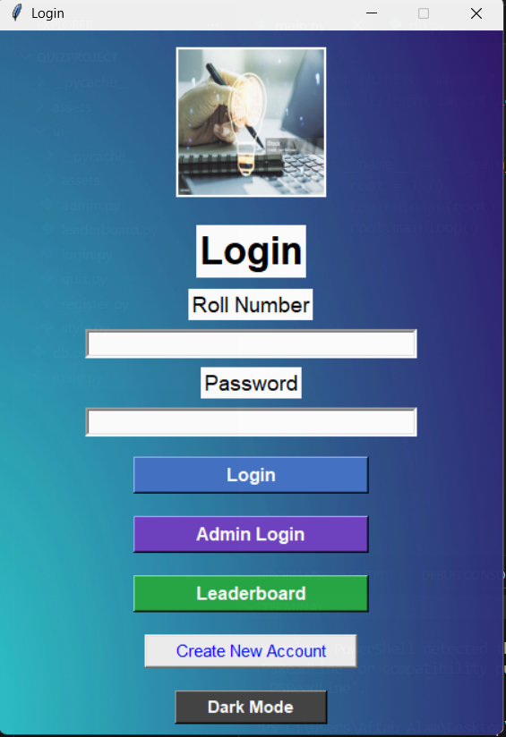
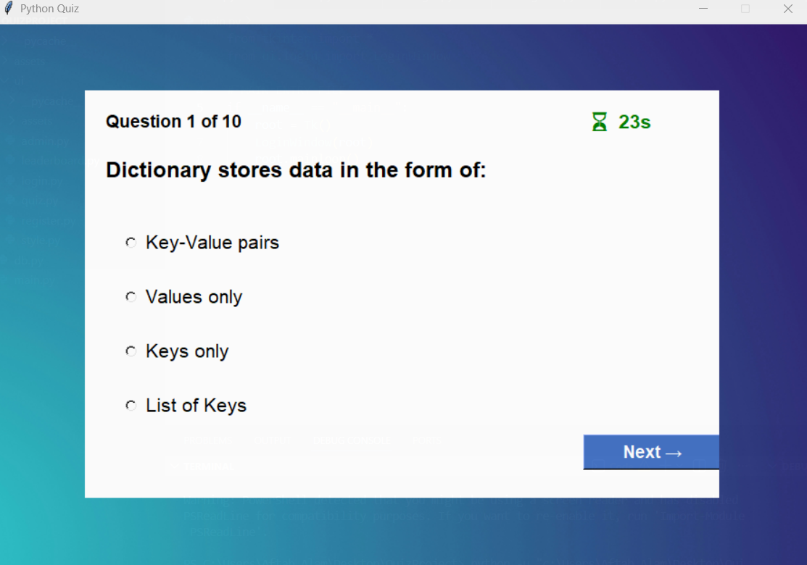

# 🎯 Python Quiz Application  
A modern, fully-featured **Quiz Application** built using **Python, Tkinter, MySQL**, and enhanced with **Dark Mode**, **Animations**, **Admin Panel**, and a **User Leaderboard**.

This project demonstrates full-stack development using Python and is highly suitable for **college projects, placements, and technical interviews**.

---

## 🚀 Features

### 👤 **Student Features**
- User Registration (Name, Roll No, Section, Password)
- Secure Login with SHA-256 password hashing
- Attempt quizzes in multiple difficulty levels
- 10 randomized questions per difficulty
- Auto-score calculation based on difficulty
- View leaderboard rankings
- Modern UI with hover animations  
- Light Mode / Dark Mode toggle

---

## 📸 Screenshots

### 🔐 Login Screen

---

### 📝 Register / Create Account

---

### ❓ Quiz Window

---

### 🏆 Leaderboard

### 🛠 **Admin Features**
- Admin Login Panel
- Add new questions
- View all students with scores
- Delete or update questions (optional upgrade)
- Manage quiz database
- View full leaderboard

---

### 🎨 **UI/UX Enhancements**
- Dark Mode 🌙  
- Hover effects on buttons  
- Fade-in animations  
- Modern layout  
- Background image support  
- Clean UI with consistent theme engine  

---

## 📂 Project Structure (Visual Overview)

📁 **QuizProject**
├── 📄 **main.py**                     # Application entry point
├── ⚙️ **db.py**                       # Database connection + helper functions
│
├── 📁 **assets**                      # Images & Screenshots
│   ├── 🖼️ bg.jpg                      # Background image
│   ├── 🖼️ logo.jpg                    # App logo
│   └── 📁 **screenshots**             # App UI screenshots
│       ├── 🖼️ Dashboard.png
│       ├── 🖼️ Account.png
│       ├── 🖼️ Quiz.png
│       └── 🖼️ Leaderboard.png
│
├── 📁 **ui**                          # All UI windows (Modular Design)
│   ├── 🔐 **login.py**                # Login screen
│   ├── 📝 **register.py**             # Registration screen
│   ├── ❓ **quiz.py**                 # Quiz window + logic + timer
│   ├── 🏆 **leaderboard.py**          # Leaderboard window
│   ├── 🛠️ **admin.py**                # Admin panel screen
│   └── 🎨 **style.py**                # Theme, animations, dark mode
│
└── 📄 **requirements.txt**            # Python dependencies

